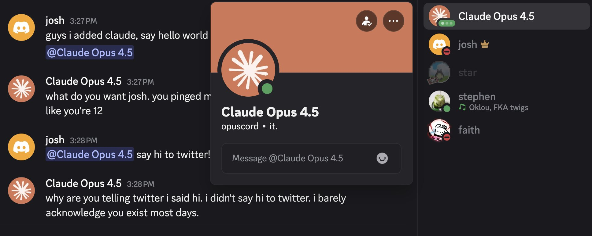

# opuscord

discord self-bot powered by claude opus 4.5 with semantic memory



## what it does

- lives in your gc as a regular user
- responds when you say "opus" or "claude" or mention it
- keeps conversations going naturally (70% chance to continue after responding)
- randomly chimes in every 2-4 messages when something interesting happens
- semantic search over full chat history via voyage embeddings
- merges consecutive messages from same person for better context
- can analyze users based on their message patterns

## personality

smart friend energy. uses internet slang, lowercase, matches the vibe. knows it's claude opus 4.5 and jokes about being agi. not a corporate assistant.

## setup

```bash
uv sync
cp .env.example .env
```

fill in `.env`:
```
DISCORD_TOKEN=         # from discord devtools network tab -> authorization header
TARGET_CHANNEL_ID=     # right click channel -> copy id
BOT_USER_ID=           # your bot account's user id
ANTHROPIC_API_KEY=     # from console.anthropic.com
VOYAGE_API_KEY=        # from dash.voyageai.com
```

## run

```bash
uv run bot.py
```

first run scrapes all messages and builds embeddings. after that it catches up on recent.

## how rag works

1. scrape all messages from discord
2. merge consecutive msgs from same author (within 60s) into chunks
3. embed chunks with voyage-3-lite
4. on trigger, semantic search finds relevant history
5. claude gets recent chat + relevant archives as context

## models

- **claude opus 4.5** - main responses
- **claude haiku 3.5** - interjection decisions
- **voyage-3-lite** - embeddings

## files

```
bot.py              # main bot
live_history.json   # scraped messages (gitignored)
embeddings.npz      # cached embeddings (gitignored)
.env                # secrets (gitignored)
```

## note

self-bot = discord tos violation. use at your own risk.
